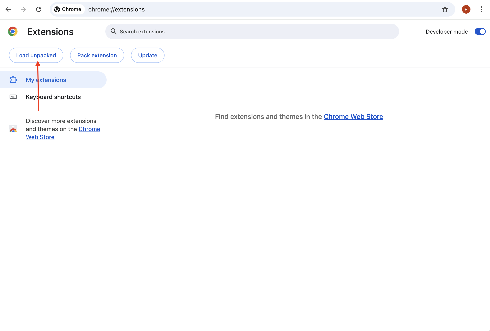

# Mee Extension

## Start using extension

- Build [Mee Extension Library](./mee-extension-lib/README.md)
- Run build in `Extension` directory
  ```sh
  pnpm run build
  ```
- All sliders should be green at the test websites

## Install browser extensions
- [Install extension manually](#install-extension-manually)
- [Install extension automatically](#install-extension-automatically)

### Install extension manually
- Open [chrome://extensions/](chrome://extensions/)
- Switch to developer mode

- Open [chrome://extensions/](chrome://extensions/)
- Switch to developer mode
  
- Click on `Load unpacked`
  
- Select the `Extension/dist/chrome` directory in the file manager

### Install extension automatically

- Run test in `Extension` directory
```sh
  pnpm run test
  ```

## Links for tests

- [https://globalprivacycontrol.org/](https://globalprivacycontrol.org/)
- [https://global-privacy-control.glitch.me/](https://global-privacy-control.glitch.me/)


### For testing in Chrome

```sh
pnpm run test:chrome
```
